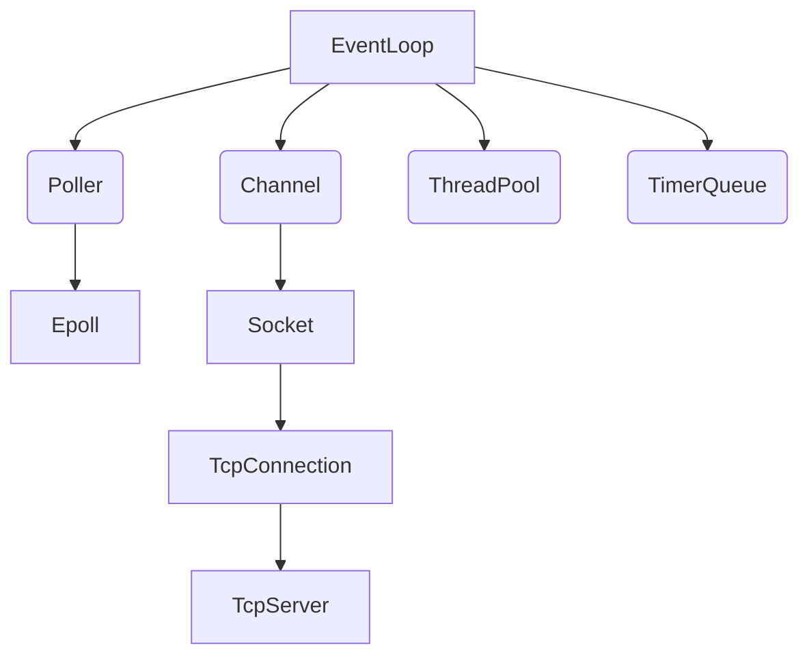
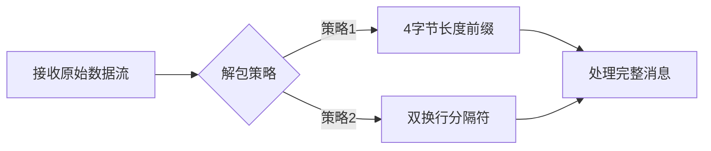

# myTinyMuduo: 一个高性能多线程C++网络库 🚀


## 📖 项目简介

**myTinyMuduo** 是一个基于 **Reactor模式** 的多线程C++网络库，复刻了muduo的优秀设计但使用 `C++20` 进行了现代化重构。

### 🌟 核心特性
- 🧵 **多线程模型**：使用标准库的 `thread` 代替传统的POSIX thread封装
- ⏱️ **精确时间戳**：基于 `<chrono>` 时间库实现高精度时间戳，替代 `gettimeofday()`
- ⚡ **高性能I/O**：使用Linux专有的epoll作为事件分发器
- 🧩 **模块化设计**：层次分明，易于扩展和维护
- 📚 **简洁API**：使用者只需关注网络业务逻辑

### 🛠️ 技术架构


## 🚀 快速开始

### 安装依赖
```bash
# Ubuntu/Debian
sudo apt update
sudo apt install g++ cmake make -y
```

### 安装myTinyMuduo
```bash
git clone git@github.com:0WAQ/myTinyMuduo.git
cd myTinyMuduo
./build.sh
```

### 一个简单的Echo服务器示例
```cpp
#include <TcpServer.h>

class EchoServer {
public:
    EchoServer(mymuduo::EventLoop* loop, const mymuduo::InetAddress& addr)
        : server_(loop, addr, "EchoServer") {
        
        // 设置回调函数
        server_.set_connection_callback(
            [this](auto&& conn) { this->onConnection(conn); });
            
        server_.set_message_callback(
            [this](auto&& conn, auto&& buf, auto&& time) { 
                this->onMessage(conn, buf, time); 
            });
        
        // 设置3个工作线程
        server_.set_thread_num(3);
    }

    void start() { server_.start(); }

private:
    void onConnection(const TcpConnectionPtr& conn) {
        LOG_INFO("%s Connection %s\n", 
                 conn->connected() ? "New" : "Closed",
                 conn->peer_address().ip_port().c_str());
    }

    void onMessage(const TcpConnectionPtr& conn, Buffer* buf, Timestamp time) {
        std::string msg;
        if(buf->pick_datagram(msg)) {
            processMessage(buf, msg);  // 处理消息分界
            conn->send(msg);           // 回发消息
        }
    }

    mymuduo::TcpServer server_;
};

int main() {
    mymuduo::EventLoop loop;
    mymuduo::InetAddress addr("127.0.0.1", 8888);
    
    EchoServer server(&loop, addr);
    server.start();
    
    loop.run_every(1.0, [](){
        LOG_INFO("Heartbeat - server running\n");
    });

    loop.loop();
}
```

## 🔍 TCP粘包解决方案
myTinyMuduo的 `Buffer` 类内置了两种处理TCP粘包的方法：


## 📚 技术栈与参考资料
### 核心技术
- **Reactor模式**：事件驱动的核心架构
- **one loop per thread**：高并发处理模型
- **边缘触发(ET)**：高效epoll工作模式
- **无锁设计**：最大限度减少线程竞争
- **RAII资源管理**：自动内存资源管理

### 参考资料
1. 🏆 **陈硕的muduo库**：[github.com/chenshuo/muduo](https://github.com/chenshuo/muduo)
2. 🌐 **TinyWebServer**：[github.com/qinguoyi/TinyWebServer](https://github.com/qinguoyi/TinyWebServer)
3. ✍️ **详细开发笔记**：[Linux多线程服务端编程](https://www.cnblogs.com/S1mpleBug/p/16712003.html)
4. 📘 **经典书籍**：陈硕《Linux多线程服务端编程：使用muduo C++网络库》

---

**myTinyMuduo** - 轻量高效，让网络编程更简单！通过简洁的API即可构建高性能网络服务，专注于您的业务逻辑而非底层细节。